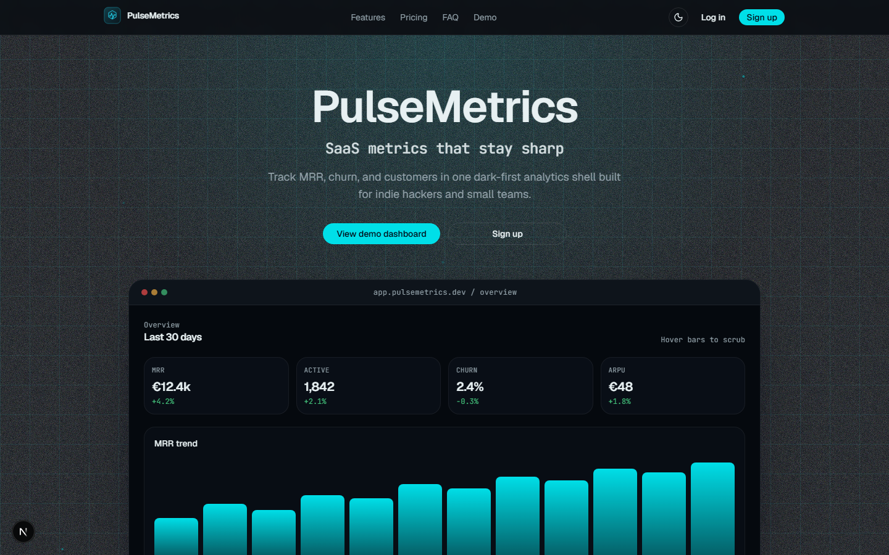
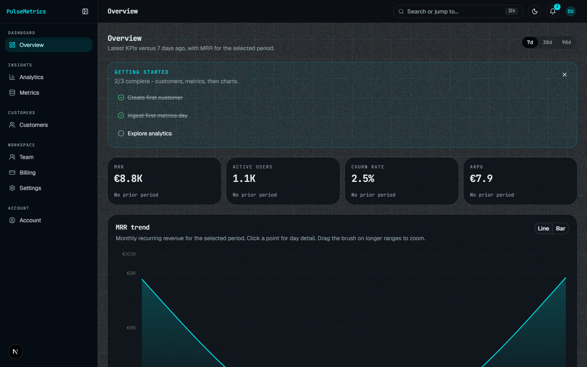

# PulseMetrics

[](https://github.com/Marko-Vuchko/pulse-metrics/actions)
[](https://marko-vuchko.github.io/pulse-metrics/)
[](./LICENSE)

SaaS analytics dashboard by [Fluxis Labs](https://github.com/Marko-Vuchko) - MRR, churn, ARPU, and customer ops in a dark-first Next.js shell backed by hosted Supabase.

Portfolio demo of App Router, SSR auth, RLS multi-tenant data, shadcn/ui, Recharts, and Playwright CI.

## Try it

| | |
|---|---|
| **Live showcase** | [marko-vuchko.github.io/pulse-metrics](https://marko-vuchko.github.io/pulse-metrics/) - ~40s walkthrough video + product stills |
| **Demo login** (local / hosted Supabase) | Email `demo@fluxislabs.com` · Password `fluxis-demo-2026` |
| **Case study** | [`docs/CASE-STUDY.md`](docs/CASE-STUDY.md) - problem → architecture → trade-offs → v2 |

> The GitHub Pages site is a **static portfolio showcase** (video + screenshots). It is not the full Next.js runtime. Auth, RLS, and dashboard flows need a local or Node-hosted run against Supabase.

## Screenshots & walkthrough

[~40s product walkthrough](https://marko-vuchko.github.io/pulse-metrics/#walkthrough) (landing → demo login → customers CRUD → analytics). Local copy: [`docs/videos/walkthrough.mp4`](docs/videos/walkthrough.mp4).

Landing:



Dashboard overview with MRR chart:



## Intentional demo surfaces

Scoped on purpose for a portfolio walkthrough - not unfinished stubs:

| Surface | What it does | What it does not |
|---|---|---|
| Billing | Fake checkout persists `billing_plan` on your profile | Stripe, charges, webhooks |
| Team | Invite rows under owner tenant RLS | Shared ACL / teammate data access |
| Notifications | Static topbar alerts for UI polish | DB-backed notification feed |
| Google OAuth | Checklist + `/auth/callback` PKCE route | Live Client ID/Secret (optional via env) |

## Stack

| Layer | Choice |
|---|---|
| App | Next.js 16 (App Router), React 19, TypeScript |
| UI | Tailwind CSS v4, shadcn/ui, next-themes, Sonner |
| Charts | Recharts |
| Backend | Hosted Supabase (Auth + Postgres + RLS) |
| Forms | react-hook-form + Zod |
| Observability | Vercel Analytics + Speed Insights, optional Sentry |
| QA | ESLint, Vitest, Playwright, Lighthouse CI, GitHub Actions |

## Quick start

Hosted Supabase only - no Docker, no `supabase start`, no Inbucket. Email confirmation uses a real inbox.

```bash
npm install
cp .env.local.example .env.local
# Fill NEXT_PUBLIC_SUPABASE_URL + NEXT_PUBLIC_SUPABASE_PUBLISHABLE_KEY
npm run dev
```

Open [http://localhost:3000](http://localhost:3000).

### Schema & auth

Migrations: `supabase/migrations/`. Seed: `supabase/seed.sql`.

```bash
npx supabase link --project-ref <PROJECT_ID>
npx supabase db push
npx supabase gen types typescript --project-id <PROJECT_ID> > types/database.ts
```

In Supabase Auth → URL configuration:

- **Site URL**: `http://localhost:3000` (and your production URL)
- **Redirect URLs**: `/login`, `/auth/callback` (dev + production)

Google OAuth stays checklist-only until `NEXT_PUBLIC_GOOGLE_OAUTH_ENABLED=1`.

## Scripts

| Script | Purpose |
|---|---|
| `npm run dev` | Local Next.js server |
| `npm run lint` / `typecheck` | ESLint + `tsc --noEmit` |
| `npm test` / `test:coverage` | Vitest unit tests + coverage gate |
| `npm run build` | Production build |
| `npm run test:e2e` | Playwright mock-auth smoke (CI default) |
| `npm run test:e2e:hosted` | Hosted Supabase e2e (needs `.env.local`) |
| `npm run lighthouse` | Landing Lighthouse budgets (after `build`) |
| `npm run record:walkthrough` | Re-record the portfolio walkthrough video |

## Testing

**Mock auth (CI):** `PULSE_E2E_MOCK_AUTH=1` + `pulse_e2e_mock` cookie. Covers landing, theme, overview KPIs, customers search/filter, axe a11y.

**Unit:** Zod schemas, helpers (CSV, query parsers, rate limit, safe errors), mocked Server Actions.

**Hosted e2e:** `npm run test:e2e:hosted` against seeded demo user. Optional CI via `ENABLE_HOSTED_E2E=true` + Action secrets, then **Actions → CI → Run workflow**.

## Architecture

```text
Browser
  └─ Next.js App Router (RSC + Server Actions)
       ├─ proxy.ts → session refresh / route guards
       ├─ lib/supabase/* → SSR + browser clients
       ├─ lib/data/* → tenant-scoped metrics & customers
       └─ Hosted Supabase (Auth JWT + Postgres RLS)
```

- Tenant isolation: `tenant_id = auth.uid()`
- Dashboard pages fetch in Server Components; charts are client islands
- Mock auth is env-gated and never used in normal product traffic
- Marketing motion (`AmbientField`) respects `prefers-reduced-motion`; no Three.js / Spline

## Ops notes

| Item | Notes |
|---|---|
| Security headers | CSP, frame options, Referrer-Policy, HSTS in `next.config.ts` |
| Sentry | Optional `NEXT_PUBLIC_SENTRY_DSN`; source maps need `SENTRY_*` tokens |
| Lighthouse | `lighthouserc.js` budgets in CI after the quality job |
| Supabase | Enable Auth leaked-password protection when going live |

## Folder map

```text
app/               Auth, dashboard, legal, SEO
components/        auth | dashboard | landing | legal | ui
lib/               data, supabase, e2e mock, security
supabase/          migrations + seed
e2e/               Playwright specs
site/              GitHub Pages showcase source
docs/              PRD, case study, images, walkthrough video
.github/workflows/ CI
```

## Quality gates

- `npm run lint`, `typecheck`, `test`, and `build` must pass
- GitHub Actions: lint + unit/coverage + build + Playwright (mock) + Lighthouse
- Full product smoke: `npm run test:e2e:hosted` (optional CI)

## License

MIT - see [`LICENSE`](./LICENSE).

Built by Fluxis Labs (Marko Vuchko) as a portfolio product. Requirements: [`docs/PRD-SOW.md`](docs/PRD-SOW.md). Status: [`docs/PHASE-STATUS.md`](docs/PHASE-STATUS.md).
